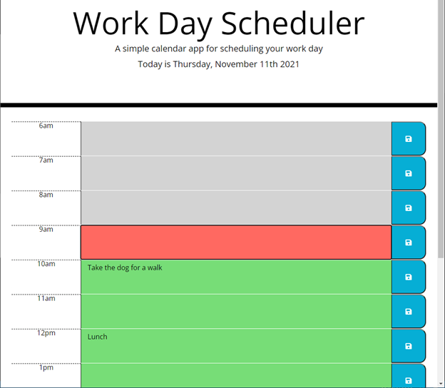

# Work Day Scheduler

  ## Description:
  Make a schedule for your day by adding events for each hour.  The schedule will display the current date and use colors to indicate if an hour is past (gray), current (red), or future (green).  All events are saved in local storage.

  ## Demo:
   

  ## Built with:
  HTML, CSS, and Javascript

  ## Website:
  https://github.com/johnrip89/Work-Day-Scheduler
  
  https://johnrip89.github.io/Work-Day-Scheduler/

  ## Contribution:
  Made by John Ripplinger